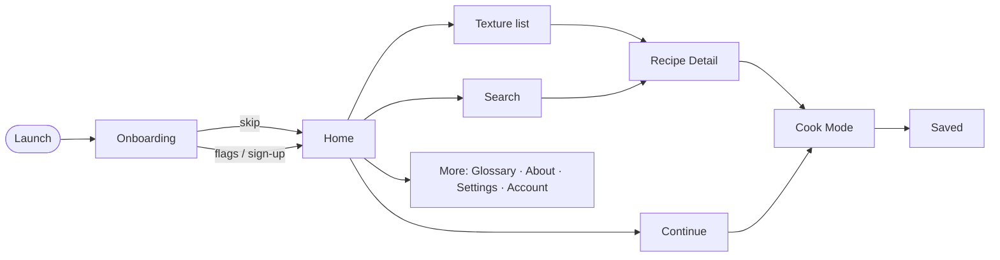

# User Flows — Vajeeva

**App:** Vajeeva — Ayurvedic *Vajikarana Āhāra* dietary app
**Companion to:** [Design-Brief.md](Design-Brief.md)
**Date:** 2026-08-17 · **Status:** ✅ **v1 cut locked** (2026-08-17) — defer `C*`, `P22`, `P36–P38`

This document enumerates **every** user flow across all actors, then marks the v1 cut. Flow IDs are stable references (`P6`, `AD2`, …) for use in specs, tickets, and prototypes.

---

## 1. Actors

| Actor | Surface | In v1? |
|---|---|---|
| **Patient** (anonymous or account) | Mobile app | ✅ Primary |
| **Clinician** | Mobile app | ⏳ Deferred (fast-follow) |
| **Admin / Editor** | Web CMS | ✅ Content ops |
| **Clinical Reviewer** | Web CMS | ✅ Content ops |

## 2. Legend & v1 scope

- `v1` — ships in first release
- `fast-follow` — designed now, built shortly after core
- `later` — deferred past v1

**Decisions already locked** (from Design-Brief §6, §11–12):
- Texture-first home (Solid · Liquid · Semi-solid)
- Anonymous-first; account optional (email/phone OTP; no social login)
- Light safety profile (health flags → filtering + "Safe for you")
- Clinician features deferred; Stats/time-tracking is fast-follow
- English-first; illustration image system; free / clinic-distributed
- CMS: **lightweight** — likely headless (see §7)

---

## 3. Patient flows

Core navigation model:

### 3.1 Entry & onboarding
| ID | Flow | Status |
|---|---|---|
| `P1` | First launch → Onboarding (welcome/privacy) → **Skip** → Home *(anonymous)* | v1 |
| `P2` | First launch → Onboarding → set **health flags** → prefs → Home | v1 |
| `P3` | First launch → Onboarding → **Sign up** (email/phone OTP) → Home | v1 |
| `P4` | Returning on new device → **Log in** → sync saved + flags → Home | v1 |
| `P5` | Reopen (returning) → Home *(returning state: Continue + Saved peek)* | v1 |

### 3.2 Core: find → cook → save *(the hero)*
| ID | Flow | Status |
|---|---|---|
| `P6` | Home → texture pillar → Texture list → card → **Detail** → Start cooking → **Cook Mode** → finish → **Save** | v1 ⭐ |
| `P7` | Home → **Continue** → Cook Mode (resume mid-step) → finish | v1 |
| `P8` | Home → Search → result → Detail → cook | v1 |
| `P9` | Texture list → **Filter** → narrowed → Detail → cook | v1 |
| `P10` | Home → sub-type chip (e.g. Sweets) → Detail → cook | v1 |

### 3.3 Discovery
| ID | Flow | Status |
|---|---|---|
| `P11` | Browse → facet (ingredient/type/meal) → results → Detail | v1 |
| `P12` | Search (English · Sanskrit · ingredient) → typed results → Detail **or** Glossary term | v1 |
| `P13` | Search → **no results** → empty state → refine | v1 |
| `P14` | Filter (diabetic-safe · dairy-free · no-cook · make-ahead · time) → results | v1 |
| `P15` | Home **"Safe for you"** chip → filtered safe results | v1 |

### 3.4 Recipe & cook interactions
| ID | Flow | Status |
|---|---|---|
| `P16` | Detail → expand **Sources** → read | v1 |
| `P17` | Detail → **units toggle** (g ⇄ cup) | v1 |
| `P18` | Detail → **pronunciation** tap | v1 |
| `P19` | Detail → **alternative method** (bake/air-fry/pressure) → Cook Mode with that variant | v1 |
| `P20` | Detail → **Save** ♡ → toast | v1 |
| `P21` | Detail → ingredient **checklist** (shopping) | v1 |
| `P22` | Detail → **Share** (link/PDF) | later |
| `P23` | Cook Mode → Next / Back / swipe steps | v1 |
| `P24` | Cook Mode → **start timer** → runs → completes (notification) | v1 |
| `P25` | Cook Mode → **exit mid-cook** → resume later via Continue | v1 |
| `P26` | Cook Mode → last step → **finish** → Save prompt → Saved | v1 |

### 3.5 Saved
| ID | Flow | Status |
|---|---|---|
| `P27` | Saved → open (offline) → Cook Mode | v1 |
| `P28` | Saved → remove | v1 |
| `P29` | Saved **empty** → prompt to browse | v1 |

### 3.6 Account
| ID | Flow | Status |
|---|---|---|
| `P30` | Anonymous → Sign up → **merge** anon saved into account | v1 |
| `P31` | Profile → edit **health flags** → safety filtering updates | v1 |
| `P32` | Settings → units / language / text size | v1 |
| `P33` | Profile → **sign out** | v1 |
| `P34` | Profile → **delete account & data** → confirm → wiped | v1 |
| `P35` | Log in → **forgot / OTP** recover | v1 |

### 3.7 Insights *(fast-follow)*
| ID | Flow | Status |
|---|---|---|
| `P36` | More → **Stats** → time spent + activity | fast-follow |
| `P37` | Stats **empty** (anon/new) → empty state | fast-follow |
| `P38` | Settings → **turn off tracking** | fast-follow |

### 3.8 Reference & support
| ID | Flow | Status |
|---|---|---|
| `P39` | More → **Glossary** → term → meaning/pronunciation → recipes using it | v1 |
| `P40` | More → **About / Evidence** → sources → Disclaimer | v1 |
| `P41` | More → **Settings** → privacy → clear data | v1 |

### 3.9 Safety & edge / offline
| ID | Flow | Status |
|---|---|---|
| `P42` | Flag = diabetes → browse → unsafe recipes **flagged/filtered**; Detail shows strong warning | v1 |
| `P43` | **Offline** → open Saved → Cook works; Browse shows offline state | v1 |
| `P44` | **Image missing** → branded illustration placeholder | v1 |
| `P45` | Prep-ahead recipe → **"start tonight"** nudge → Detail overnight step | v1 |
| `P46` | Timer **notification** (discreet, no health wording) → back into recipe | v1 |

---

## 4. Clinician flows *(deferred — not v1)*
| ID | Flow | Status |
|---|---|---|
| `C1` | Search by ingredient / benefit / classical name → Recipe | later |
| `C2` | Detail → check Sources / evidence | later |
| `C3` | Recipe → **Share to patient** (link/PDF) | later |
| `C4` | **Recommend** recipe | later |

## 5. Admin / Editor flows (web CMS)
| ID | Flow | Status |
|---|---|---|
| `AD1` | Login → Dashboard | v1-content |
| `AD2` | New recipe → §5 schema form → tag facets → save **draft** | v1-content |
| `AD3` | Edit recipe → update → **submit for review** | v1-content |
| `AD4` | Upload / assign **illustration** → recipe | v1-content |
| `AD5` | Manage **Glossary** term | v1-content |
| `AD6` | Manage libraries (sources · contraindications · taxonomy) | v1-content |
| `AD7` | Dashboard → fix **missing images** | v1-content |
| `AD8` | Manage users / roles | v1-content |

## 6. Clinical Reviewer flows (web CMS)
| ID | Flow | Status |
|---|---|---|
| `R1` | Review queue → open draft → check contraindications / sources → **approve** → publish | v1-content |
| `R2` | Review → **reject** with notes → back to editor | v1-content |

---

## 7. v1 scope summary

- **Total flows:** 60 — 46 patient · 4 clinician · 10 CMS.
- **Patient v1:** all `P*` **except** `P22` (Share → later) and `P36–P38` (Stats → fast-follow).
- **Deferred:** all `C*` (clinician), `P22`, `P36–P38`.
- **CMS build note:** if a **headless CMS** (Sanity / Strapi / Contentful) is adopted, the `AD*` / `R*` flows are provided by the tool's own UI (editor, media library, roles, draft→publish) modeled to the §5 schema — they are **not** screens we design. Custom admin is only needed for bespoke workflows.

## 8. Open questions
1. ~~Confirm the v1 cut~~ — **locked 2026-08-17**: defer `C*`, `P22`, `P36–P38`. v1 patient = 42 flows.
2. CMS: headless vs custom — decides whether `AD*`/`R*` are a design track.
3. Notifications (`P24`, `P46`): confirm discreet, no health wording; opt-in.

---

*Next: ~~lock the v1 set~~ ✅ → ~~render the v1 patient flows as a visual flow map~~ ✅ (see flow-map artifact) → wireframe the undesigned screens.*
